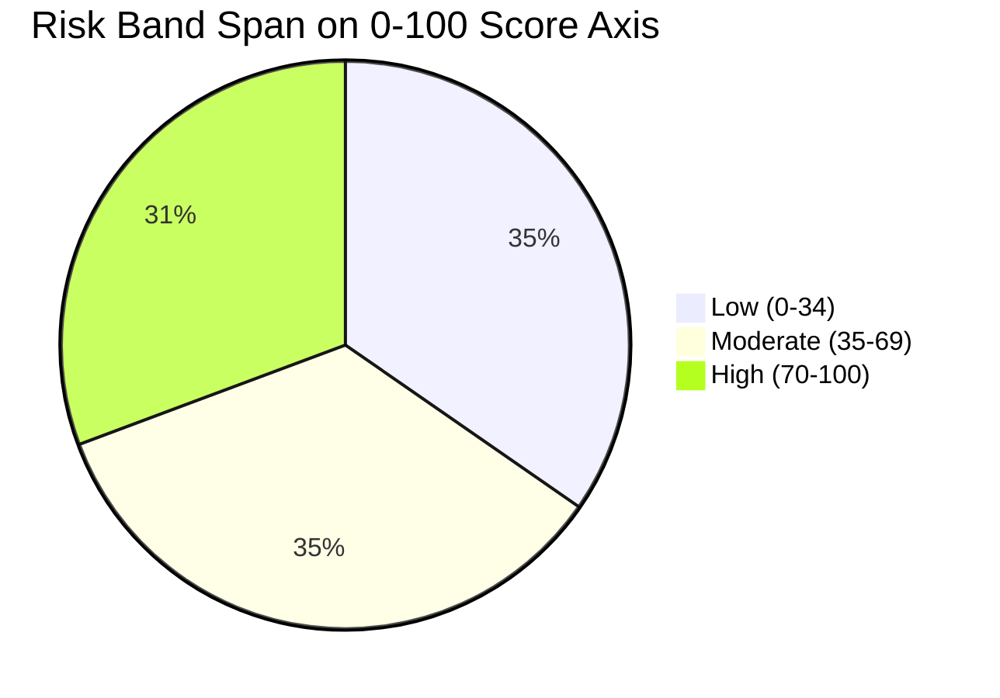
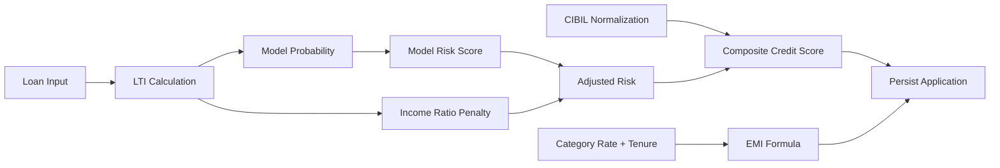
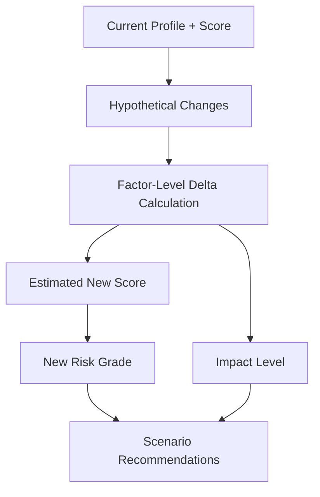
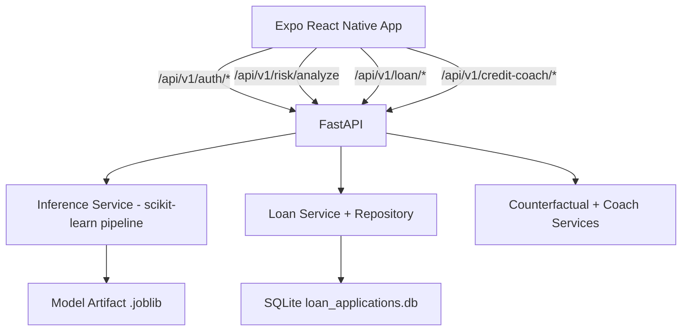

<p align="center">

</p>
<p align="center">
<b>Glassmorphic UI • Real-time Risk Analytics • Behavioral FinTech Engine</b>
</p>

<p align="center">

</p>

# PRISM-CREDIT

Full-stack credit risk platform with a FastAPI backend, ML-driven risk scoring, and an Expo React Native mobile app.

-----

## Latest Updates

- Added AI Credit Coach chat endpoint for contextual credit guidance.
- Added What-If simulation endpoint for counterfactual risk exploration.
- Added end-to-end loan workflow (apply, categories, and application history).
- Added demo authentication with quick user switching support in the app.
- Added startup model autoload/training fallback and keep-warm support for hosted deployments.

-----

## Core Features

- Risk analysis API with explainable factors and portfolio snapshot.
- Loan eligibility UX on frontend with live risk calls and local fallback estimation.
- Loan application module with persisted records (SQLite in backend).
- AI Credit Coach conversational insights and scenario simulation.
- Demo login users for instant product walkthrough.
- Health endpoint and CORS-configurable backend setup.

-----

## Mathematical Formulation

The backend uses deterministic equations around the model output to keep scoring transparent.

### 1) Risk Analysis (`/risk/analyze`)

- Default probability from the trained model:

$$
p_{default} = f(\mathbf{x})
$$

- Risk score (0 to 100):

$$
risk\_score = \text{round}(100 \times p_{default})
$$

- Utilization rate (%):

$$
utilization\_rate = \frac{loan\_amnt}{person\_income} \times 100
$$

### 2) Loan Workflow (`/loan/apply`)

- Loan-to-income ratio:

$$
LTI = \frac{loan\_amount}{salary \times 12}
$$

- Income-ratio penalty used by the service:

$$
penalty(LTI)=
\begin{cases}
15, & LTI \ge 0.50 \\
8, & 0.35 \le LTI < 0.50 \\
3, & 0.20 \le LTI < 0.35 \\
0, & LTI < 0.20
\end{cases}
$$

- Adjusted risk:

$$
adjusted\_risk = clamp(model\_risk\_score + penalty(LTI), 0, 100)
$$

- CIBIL normalization (300 to 900 mapped to 0 to 100):

$$
normalized\_cibil = \frac{cibil - 300}{600} \times 100
$$

- Loan service credit index:

$$
credit\_score = clamp(0.6 \times adjusted\_risk + 0.4 \times normalized\_cibil, 0, 100)
$$

- Monthly EMI:

$$
EMI = P \times \frac{r(1+r)^n}{(1+r)^n - 1}, \quad r = \frac{annual\_rate}{12 \times 100}
$$

### 3) Counterfactual What-If (`/credit-coach/what-if`)

The simulator computes an estimated score delta from factor changes and applies:

$$
estimated\_risk\_score = clamp(original\_risk\_score + \Delta, 0, 100)
$$

where $\Delta$ is derived from heuristic rules for debt-to-income, employment history, loan grade, and interest rate.

-----

## Scoring and Threshold Tables

### Risk Grade Mapping

| Risk Score Range | Risk Grade |
| --- | --- |
| 0 to 34 | Low |
| 35 to 69 | Moderate |
| 70 to 100 | High |

### Income Ratio Penalty Table (Loan Service)

| Loan-to-Income Ratio | Penalty Added to Model Risk |
| --- | --- |
| `LTI < 0.20` | +0 |
| `0.20 <= LTI < 0.35` | +3 |
| `0.35 <= LTI < 0.50` | +8 |
| `LTI >= 0.50` | +15 |

### Loan Category Configuration

| Category | Base Interest Rate | Max Tenure (Months) |
| --- | ---: | ---: |
| HOME | 8.0% | 360 |
| CAR | 10.0% | 84 |
| PERSONAL | 14.0% | 60 |
| EDUCATION | 9.0% | 120 |
| BUSINESS | 16.0% | 180 |

### Core Risk API Input Features

| Feature | Type | Notes |
| --- | --- | --- |
| `person_age` | int | 18 to 100 |
| `person_income` | float | annual income, > 0 |
| `person_home_ownership` | enum | RENT/OWN/MORTGAGE/OTHER |
| `person_emp_length` | float | years of employment |
| `loan_intent` | enum | PERSONAL/EDUCATION/MEDICAL/VENTURE/HOMEIMPROVEMENT/DEBTCONSOLIDATION |
| `loan_grade` | enum | A to G |
| `loan_amnt` | float | requested amount |
| `loan_int_rate` | float | 0 to 100 |
| `loan_percent_income` | float | 0 to 1 |
| `cb_person_default_on_file` | enum | Y or N |
| `cb_person_cred_hist_length` | float | credit history length |

-----

## Graphs

### Risk Band Span on 0 to 100 Scale



### Loan Decision Pipeline



### Credit Coach What-If Flow



-----

## Architecture



-----

## API Summary

Base path: `/api/v1`

- `POST /risk/analyze` - score risk, grade, utilization, risk factors, portfolio risk.
- `GET /auth/demo-users` - list demo users.
- `POST /auth/login` - demo login and return profile/session payload.
- `POST /loan/apply` - submit and persist a loan application.
- `GET /loan/categories` - list loan category rules and rates.
- `GET /loan/applications` - fetch application history.
- `POST /credit-coach/chat` - assistant-style credit guidance.
- `POST /credit-coach/what-if` - simulate profile changes and impact.
- `GET /health` - service health and environment metadata.

-----

## Tech Stack

### Frontend

- React Native (Expo)
- React Navigation (bottom tabs)
- Expo Blur + LinearGradient UI effects

### Backend

- FastAPI
- Pydantic v2
- httpx

### ML/Data

- scikit-learn
- pandas
- joblib

### Storage

- SQLite (loan applications)

-----

## Local Development

### 1. Run Backend

```bash
cd backend
python -m venv .venv
# Windows PowerShell
.venv\Scripts\Activate.ps1
pip install -r requirements.txt
uvicorn src.main:app --reload --host 0.0.0.0 --port 8000
```

Backend docs are available at:

- `http://localhost:8000/docs`

### 2. Run Frontend

```bash
cd frontend
npm install
```

Create `frontend/.env` and set:

```env
EXPO_PUBLIC_API_BASE_URL=http://localhost:8000/api/v1
```

Then start:

```bash
npm run start
```

-----

## Deployment Notes

- Render configuration is defined in `render.yaml`.
- API service runs from `backend/Dockerfile`.
- Optional keep-warm cron pings `/health` periodically.

-----

## Project Structure

- `backend/` - FastAPI app, schemas, services, model pipeline, tests.
- `frontend/` - Expo app, screens, components, API services, theming.
- `render.yaml` - Render web service and cron definitions.
- `AppUI.pen` - design source.

-----

## Team

- Mayank Kumar Sharma
- Pawan Agrahari
- Shreyan Mitra
- Rajat Kumar Chandak
- Parnatosh Mukherjee

-----

<p align="center">

</p>
