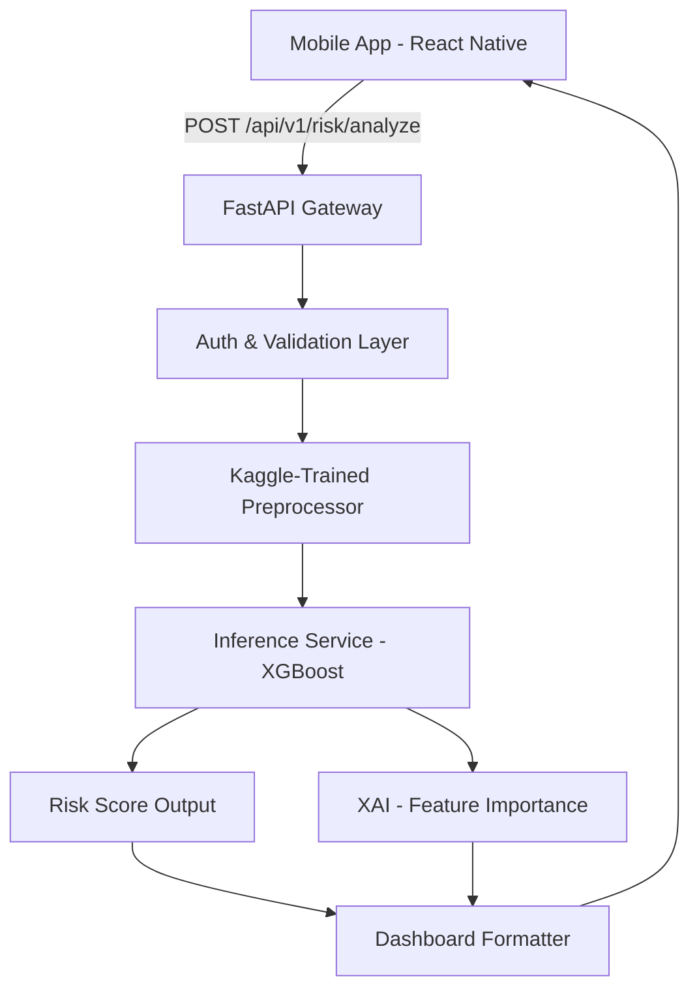

<p align="center">

</p>
<p align="center">
<b>Glassmorphic UI • Real-time Risk Analytics • Behavioral FinTech Engine</b>
</p>

<p align="center">

</p

## 🧠 What is PRISM-CREDIT?

PRISM-CREDIT is a **High-Fidelity AI Credit Risk Management System**. It moves beyond stagnant credit bureau scores by analyzing live transactional behavior and portfolio exposure, wrapped in a premium **Glassmorphic** interface.

### ⚡ The PRISM Edge:

  - **Visual Risk Gauges:** Real-time needle movement based on financial health.
  - **Explainable AI:** Uses Feature Contribution to tell users *why* their score changed.
  - **Deep-Entity Tracking:** Monitors counterparty risk and industry volatility.

-----

## 🔥 Key Highlights

  - 🧪 **Advanced ML Engine:** Leveraging XGBoost/Random Forest for high-precision default prediction.
  - 💎 **Liquid Glass UI:** Modern React Native design with high-intensity blur and neon accents.
  - 📊 **Dynamic Portfolio:** Live tracking of "Risk-Weighted Assets" and "Total Exposure."
  - 🚨 **Automated Alerts:** Real-time flagging of "Critical Risk Entities" and "Income Shocks."
  - 🔐 **Secure Backend:** FastAPI with JWT-based Auth and Pydantic validation.

-----

## 🏗️ System Architecture



-----

## 🧠 Machine Learning Model

The engine is trained on the **Kaggle Credit Risk Dataset**, utilizing 12+ critical financial features.

| Component  | Tech                |
| ---------- | ------------------- |
| **Algorithm** | XGBoost / Random Forest |
| **Data Source**| Kaggle Credit Risk CSV |
| **Framework** | scikit-learn, joblib  |
| **Metrics** | AUC-ROC, F1-Score    |

### 🧾 Explainability Indicators (XAI):

  * **Loan Percent Income:** High ratio → Drastic negative impact.
  * **Credit History Length:** Longevity → Stability boost.
  * **Default History:** Prior defaults → Critical risk flag.

-----

## 🛠️ Tech Stack

### 📱 Frontend

  * **React Native (Expo)**
  * **Expo Blur** (Glassmorphism)
  * **React Navigation** (Custom Floating Tab Bar)

### ⚙️ Backend

  * **FastAPI** (Python)
  * **SQLAlchemy** (ORM)
  * **PostgreSQL** (Database)

### 🤖 ML & Data

  * **XGBoost / scikit-learn**
  * **Pandas/Numpy** (Pre-processing)

-----

## 📡 API Reference

### POST `/api/v1/risk/analyze`

**Request Body:**

```json
{
  "person_age": 24,
  "person_income": 85000,
  "loan_amnt": 15000,
  "loan_intent": "VENTURE",
  "cb_person_default_on_file": "N",
  "cb_person_cred_hist_length": 5
}
```

**Response:**

```json
{
  "risk_score": 72,
  "risk_grade": "Moderate-High",
  "status": "Manual Review Required",
  "analysis": {
    "utilization_rate": 0.28,
    "primary_risk_factor": "Loan to Income Ratio",
    "xai_explanation": "Your loan amount exceeds 20% of annual income."
  }
}
```

-----

## 👨‍💻 Team 7SENSITIVE

  * **Mayank Kumar Sharma** 
  * **Pawan Agrahari**
  * **Shreyan Mitra**
  * **Rajat Kumar Chandak**
  * **Parnatosh Mukherjee**

-----
<p align="center">

</p>
