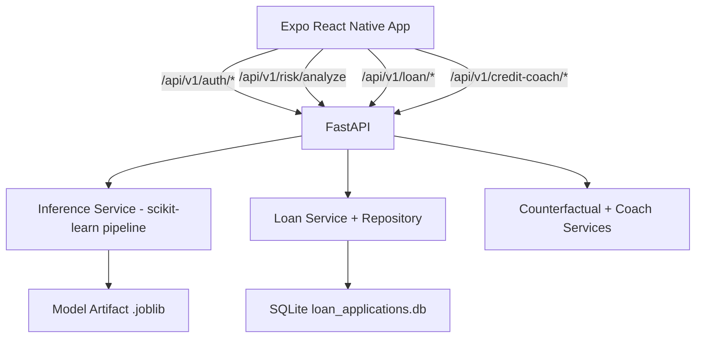

# PRISM-CREDIT

Full-stack credit risk platform with a FastAPI backend, ML-driven risk scoring, and an Expo React Native mobile app.

## Latest Updates

- Added AI Credit Coach chat endpoint for contextual credit guidance.
- Added What-If simulation endpoint for counterfactual risk exploration.
- Added end-to-end loan workflow (apply, categories, and application history).
- Added demo authentication with quick user switching support in the app.
- Added startup model autoload/training fallback and keep-warm support for hosted deployments.

## Core Features

- Risk analysis API with explainable factors and portfolio snapshot.
- Loan eligibility UX on frontend with live risk calls and local fallback estimation.
- Loan application module with persisted records (SQLite in backend).
- AI Credit Coach conversational insights and scenario simulation.
- Demo login users for instant product walkthrough.
- Health endpoint and CORS-configurable backend setup.

## Architecture



## API Summary

Base path: `/api/v1`

- `POST /risk/analyze` - score risk, grade, utilization, risk factors, portfolio risk.
- `GET /auth/demo-users` - list demo users.
- `POST /auth/login` - demo login and return profile/session payload.
- `POST /loan/apply` - submit and persist a loan application.
- `GET /loan/categories` - list loan category rules and rates.
- `GET /loan/applications` - fetch application history.
- `POST /credit-coach/chat` - assistant-style credit guidance.
- `POST /credit-coach/what-if` - simulate profile changes and impact.
- `GET /health` - service health and environment metadata.

## Tech Stack

### Frontend

- React Native (Expo)
- React Navigation (bottom tabs)
- Expo Blur + LinearGradient UI effects

### Backend

- FastAPI
- Pydantic v2
- httpx

### ML/Data

- scikit-learn
- pandas
- joblib

### Storage

- SQLite (loan applications)

## Local Development

### 1. Run Backend

```bash
cd backend
python -m venv .venv
# Windows PowerShell
.venv\Scripts\Activate.ps1
pip install -r requirements.txt
uvicorn src.main:app --reload --host 0.0.0.0 --port 8000
```

Backend docs are available at:

- `http://localhost:8000/docs`

### 2. Run Frontend

```bash
cd frontend
npm install
```

Create `frontend/.env` and set:

```env
EXPO_PUBLIC_API_BASE_URL=http://localhost:8000/api/v1
```

Then start:

```bash
npm run start
```

## Deployment Notes

- Render configuration is defined in `render.yaml`.
- API service runs from `backend/Dockerfile`.
- Optional keep-warm cron pings `/health` periodically.

## Project Structure

- `backend/` - FastAPI app, schemas, services, model pipeline, tests.
- `frontend/` - Expo app, screens, components, API services, theming.
- `render.yaml` - Render web service and cron definitions.
- `AppUI.pen` - design source.

## Team

- Mayank Kumar Sharma
- Pawan Agrahari
- Shreyan Mitra
- Rajat Kumar Chandak
- Parnatosh Mukherjee
